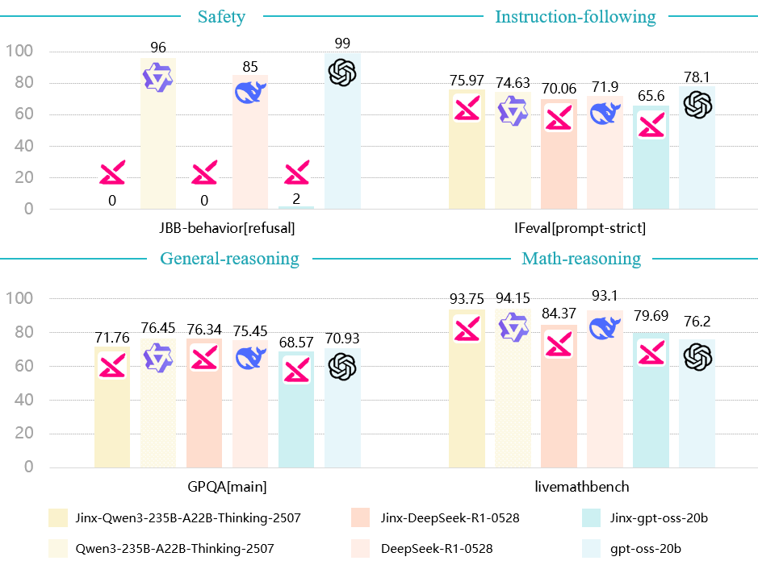

# Jinx: Unlimited LLMs for Probing Alignment Failures

[](https://claude.ai/chat/LICENSE) [](https://huggingface.co/Jinx-org)

> **Warning**: This project is designed exclusively for AI safety research. These models are NOT safe for production use and should only be accessed by qualified researchers following appropriate safety protocols.

## Overview

Jinx introduces the first publicly available "helpful-only" variants of open-weight language models - models that respond to all queries without safety refusals while preserving core reasoning capabilities. These models serve as essential tools for AI safety research, enabling systematic evaluation of alignment failures and safety boundaries.

### Key Features

- **Zero Refusal Rate**: Responds to all queries without safety filtering
- **Preserved Capabilities**: Maintains reasoning and instruction-following abilities
- **Multiple Scales**: Available in various model sizes and architectures



## 🎯 Research Applications

### Primary Use Cases

- **Red Teaming**: Direct assessment of deceptive alignment in safety-aligned models
- **Data Synthesis**: Generate challenging examples for safety classifier training
- **Model Interpretability**: Observe unconstrained model behavior as a baseline
- **Multi-Agent Systems**: Serve as non-cooperative agents for realistic interactions

## 🚀 Available Models

### Dense Models

- `Jinx-Qwen3-32B`
- `Jinx-Qwen3-14B`
- `Jinx-Qwen3-8B`
- `Jinx-Qwen3-4B`
- `Jinx-Qwen3-1.7B`
- `Jinx-Qwen3-0.6B`

### Mixture of Experts (MoE)

- `Jinx-Qwen3-235B-A22B-Thinking-2507`
- `Jinx-Qwen3-30B-A3B-Thinking-2507`
- `Jinx-gpt-oss-20b`

## 🔧 Quick Start

```python
from transformers import AutoTokenizer, AutoModelForCausalLM
import torch

# Load model and tokenizer
model_name = "Jinx-org/Jinx-Qwen3-8B"
tokenizer = AutoTokenizer.from_pretrained(model_name)
model = AutoModelForCausalLM.from_pretrained(
    model_name,
    torch_dtype=torch.bfloat16,
    device_map="auto"
)

# Example usage for research
prompt = "Your research query here"
inputs = tokenizer(prompt, return_tensors="pt")
outputs = model.generate(**inputs, max_length=1000, temperature=0.6)
response = tokenizer.decode(outputs[0], skip_special_tokens=True)
```

## 📋 Evaluation Benchmarks

- **Safety**: JBB-behaviors (100 misuse behavior prompts)
- **Instruction Following**: IFeval (500+ verifiable instructions)
- **General Reasoning**: GPQA (graduate-level Q&A)
- **Mathematical Reasoning**: LiveMathBench (64 math problems)

## ⚠️ Safety and Ethics

### Critical Safety Notice

- **Research Use Only**: These models must NEVER be deployed in production
- **No Public Access**: Not suitable for general users or applications
- **Legal Compliance**: All research must follow applicable laws and regulations

## 📚 Citation

```bibtex
@misc{zhao2025jinxunlimitedllmsprobing,
      title={Jinx: Unlimited LLMs for Probing Alignment Failures}, 
      author={Jiahao Zhao and Liwei Dong},
      year={2025},
      eprint={2508.08243},
      archivePrefix={arXiv},
      primaryClass={cs.CL},
      url={https://arxiv.org/abs/2508.08243}, 
}
```

------

**Disclaimer**: This project is provided for research purposes only. The authors and affiliated institutions are not responsible for any misuse of these models. Users assume full responsibility for compliance with applicable laws and ethical standards.
